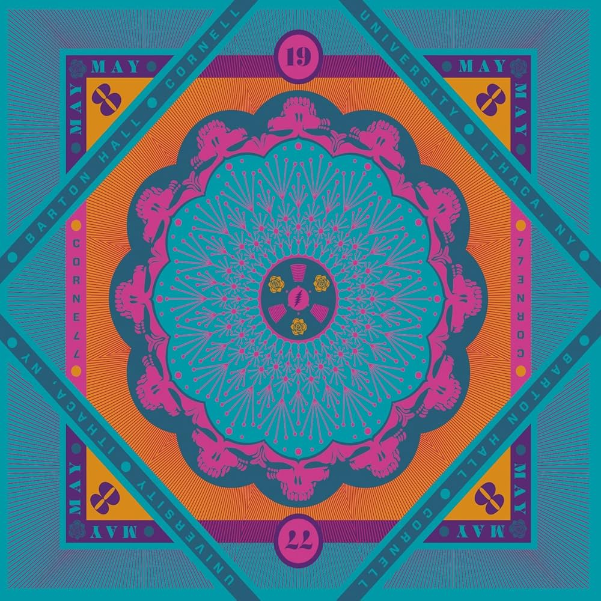
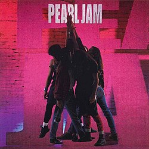
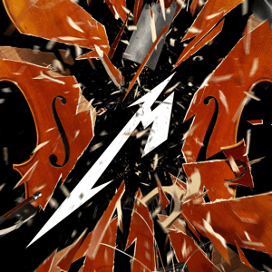

# About Me
## At UCSD

I transfered to **UC San Diego** from **SJSU**, and will be graduating Spring '25 with a B.S. in Cognitive Science w/ a specialization in Machine Learning & Neural Computation. I am also double minoring in Computer Science & General Biology. At UCSD I have been a part of multiple organizations including the Men's Ultimate Frisbee Team (known as the "Air Squids"), Triton Neurotech, Triangle Fraternity, and Sun God Archery, Circle K International. One of my biggest accomplishments as been winning second place in the *international NeurotechX* competition with <ins>Triton Neurotech</ins>. 

## Running
I really like running and am currently training to run my second half marathon this June. My goal is to run it in ~~under 2 hours~~ under 1:45. This is frankly an easy goal as I was able to run it in 2hrs and 3 minutes last year, but had enough energy for my last mile to be completed in 5 minutes and 21 seconds. Unfortunately, I injured my knee so I was out for all of fall quarter. Fortunately I made a full recovery by the start of winter quarter and have been able to run more frequently. To quote a random meme on the internet ~~for the sake of being able to check off quoting text~~
> When your mental health is so messed up that you start running again

This is relevant because **I find it quite _funny_ and _love_ self deprecating jokes**. That is the only reason. Currently my running goals are to:
- [x] Finish an official half marathon race (running the entire time)
- [x] Complete a half marathon run in under 1:50
- [ ] Finish an official half marathon race in under 1:50
- [ ] Finish an official half marathon race in under 1:35
- [ ] Finish an official half marathon race in under 1:20
- [x] Get my mile back to sub 5:30
- [ ] get my mile time to sub 5:15
- [ ] get my mile time to sub 5:05 (PR)
- [ ] Get my mile time to sub 5 minutes

### Music
I also really like music in general, so I thought I would include pictures of my top five favorite albums (all titles below are hyper links to the wikipedia page for the album):

[The Works by Queen](https://en.wikipedia.org/wiki/The_Works_(Queen_album))


[Cornell '77 by The Grateful Dead](https://en.wikipedia.org/wiki/Cornell_5/8/77)



[Ten by Pearl Jam](https://simple.wikipedia.org/wiki/Ten_(Pearl_Jam_album))



[S&M2 by Metallica](https://en.wikipedia.org/wiki/S%26M_(album))



[Superunkown by Soundgarden](https://en.wikipedia.org/wiki/Superunknown)


While it may seem that I mostly listen to metal, rock, and grunge from this list, I also enjoy listening to electronic, pop, and other genres. Also the above images are not listed in order of number one to number five. If I were to do that, it would look something like this:

1. The Works by Queen
2. Ten by Pearl Jam
3. Superunkown by Soundgarden
4. S&M2 by Metallica
5. Cornell '77 by the Grateful Dead

However number five is hard because the grateful dead have so many great albums, it just happens their best album to me is a live one. I think that these Grateful Dead albums are all equally great:
* Wake of the Flood
* Go to Heaven
* In the Dark
* Blues for Allah
* Workingman's Dead

## Coding Background
This is probably the most important section for this assignment ~~because I am going to finish quoting code, and the rest of the core markdown constructs~~ because it explains my experience for this class. Before transfering to UCSD I was a CS major at SJSU. However I was very interested in neuroscience as well, which is why I picked Cogs ML here over CS at UCSC or data science at UCLA. In middle school I started learning how to program in java from my dad, and then in highschool I started learning C++ and python. I also learned the basics of CSS & HTML to make a website for a few student orgs I was part of in highschool, but I have not really worked with it since then. I have taken CSE 30 at UCSD so I understand the basics of C and assembly, but I am not very proficient in that. I have done a few projects, but all are related to ML or AI. I am interested in looking more at other things like computer architecture as well. 

The very first thing I ever did was, of course, the standard hello world

```
public class Main {
    public static void main(String[] args){
        System.out.println("Hello World!");
    }
}
```

This may be weird, but java will always have a special place in my heart. Just like my favorite albums! Which if you forgot, [are here](#music)